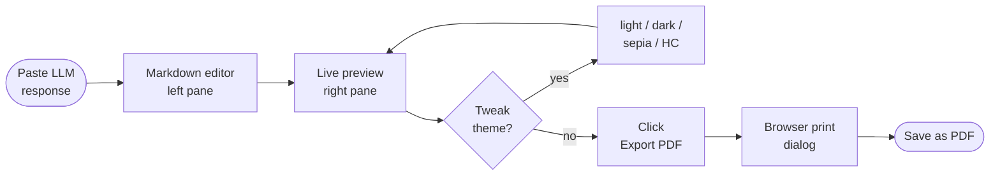

# rendermd

[](https://github.com/boostcampwm-snu-2026-1/rendermd/actions/workflows/ci.yml)
[](./LICENSE)
[](./.nvmrc)
[](./package.json)

A static web tool to preview LLM-generated markdown in real time and save it as a PDF.

> **Live:** <https://boostcampwm-snu-2026-1.github.io/rendermd/>

> Boostcamp Web & Mobile SNU 2026 — solo project (3-week shared track)

## Development setup

- Node.js `>=20`
- pnpm `>=9`

```bash
pnpm install      # install deps and activate Husky hooks
pnpm dev          # dev server (available after Next.js setup in week 2)
pnpm build        # static build → out/ (week 2+)
pnpm format       # apply Prettier
pnpm format:check # check formatting (used by CI)
pnpm test         # run Vitest (watch mode)
pnpm test:run     # run Vitest once (used by CI)
```

## Tech stack

Next.js (static export) · TypeScript · CodeMirror 6 · react-markdown · KaTeX · CSS Modules · **pnpm** · **Husky** · **Vitest** · **commitlint** · GitHub Actions

Rationale: [docs/proposal.md](./docs/proposal.md)

## Documentation

- [Project proposal](./docs/proposal.md)
- [Workflow draft](./docs/workflow.md)
- Retrospectives: [week 1](./docs/retrospective.md), [week 2](./docs/retrospective-week2.md), [week 3](./docs/retrospective-week3.md)
- [Contributing guide](./CONTRIBUTING.md)

## Demo

### User flow



### Layout sketches

```
Desktop (≥ 768px)
┌──────────────────────────────────────────────────────────┐
│ rendermd                  [Theme ▾] [💾 Saved] [📄 PDF]  │
├──────────────────────────┬───────────────────────────────┤
│  Markdown input          │   Live preview                │
│  (CodeMirror 6)          │   (react-markdown)            │
└──────────────────────────┴───────────────────────────────┘

Mobile (< 768px)
┌─────────────────────────────┐
│ rendermd  [Theme] [📄 PDF]  │
├─────────────────────────────┤
│ [ Edit │ Preview ]          │
├─────────────────────────────┤
│  Current tab content        │
└─────────────────────────────┘
```

> Real screenshots and a screen capture GIF replace these sketches once the UI lands in week 2. See [`docs/screenshots/`](./docs/screenshots/) for the gallery convention.

## Branch strategy

```
main         ← deployed (GitHub Pages auto-deploy)
 ↑
dev          ← integration
 ↑
feature/*    ← per-feature
```

- No direct pushes to `main`.
- `feature/*` PRs merge into `dev`.
- `dev` → `main` PRs trigger auto deploy.

## Commits

Follows [Conventional Commits](https://www.conventionalcommits.org/). The Husky `commit-msg` hook runs `commitlint` and rejects non-conforming messages.

Example: `feat(editor): add CodeMirror markdown highlighting`

See [CONTRIBUTING.md](./CONTRIBUTING.md) for the full format.

## Author

- 최재혁 / jay20012024

## License

[MIT](./LICENSE)
